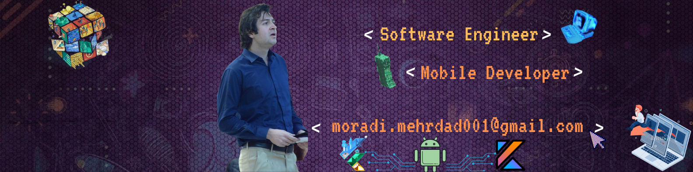

### Hey there, My name is Mehrdad Moradi and I am glad you are visiting my profile now! 

- 👑 I have a lot of passion to learn
- 🔭 My main focus right now is on developing mobile apps using Flutter💙
- 🤖 I also have experience with native android
- 🌎 I like to share my experience and knowledge with everyone
- 👯 I’m looking to collaborate on your projects especially making free content for developers
- 🧑‍💻 I’m looking to collaborate on open source projects.
- 💬 Ask me about [Flutter](https://flutter.dev) and [Dart](https://dart.dev).
- ⚡ Passionate about new mobile technologies.
- 🤩 Fun fact: I Love 📈Personal growth and development, 🏀Basketball, and 🚀Space
- 😄 Pronouns: he/him/his
- 🌏 You can find me in social that is mentioned in bottom
- 📨 Or for fast way just send me a Mail in moradi.mehrdad001@gmail.com
- 💼 Tools: Android Studio, Xcode and Git

 

Join Me In Socials!

    

 

## Languages & Tools

 

## Github Stats

## My videos on YouTube

